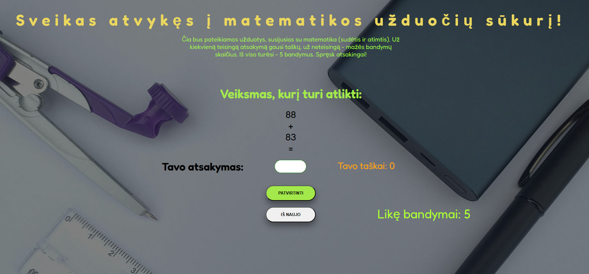

# Mathematics for Kids 🧮

This project is primarily focused on practicing **JavaScript** rather than design or responsiveness.

### 🎯 Overview

The core functionality:
- Two random numbers are generated
- A random operation is chosen: **addition or subtraction**
- To simplify for young learners (this app was created for my first-grade son), **if the second number is greater than the first, the numbers are swapped** — this prevents negative results, as children at that level have not yet learned them.
- The user types the answer into an input field.
- If the answer is correct, the score increases by 1.
- If the answer is wrong, the score stays the same, but the number of attempts decreases by 1.

The game allows up to **5 attempts per session**. Once attempts reach 0, the game **stops** and the "Check" button is disabled to prevent further input.

There are currently a few **minor bugs**, but they will be resolved soon 🙂

---

### 🛠️ Technologies Used

- **JavaScript**
- **HTML**
- **SCSS**

---

### 🔗 Live Preview

👉 [Try the game here](https://rokassturma.github.io/Mathematics-for-kids/)

